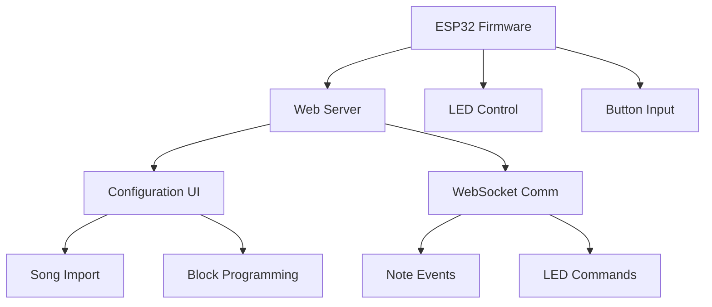

# Floor Piano Project Documentation

## Project Overview
Educational & therapeutic floor piano kit designed for children to build, program, and play. The project focuses on creating a durable, modular floor piano that combines hardware interaction with software programmability.

### Key Features
- 3-key prototype (2 white, 1 black) with LED feedback
- ESP32-based hardware control
- Web-based programming interface
- Low latency response (<20ms)
- Illuminated key feedback using Boomwhacker colors
- Open-system programmability for creating songs and assigning notes

## Current Status (2025-05-30)
- ✅ PlatformIO environment setup completed
- ✅ Basic I/O implementation for Arduino Uno (temporary solution)
  - 3-button input with debouncing
  - WS2812B LED control with Boomwhacker colors (3 strips × 3 LEDs)
  - Serial debugging output
- ⚠️ ESP32 hardware issues resolved (new ESP32-S3 ordered)
- 🔄 Transitioning from temporary Arduino implementation to final ESP32-S3 solution

## Hardware Setup

### Components
#### Current (Arduino Uno)
- Arduino Uno Dev Board
- 3 Pushbuttons
- 3 WS2812B LED strips (3 LEDs per strip)
- 5V/2A power supply with barrel jack

#### Pin Configuration (Arduino)
- Button Pins: Digital 2, 3, 4
- LED Data Pin: Digital 6
- Power: 5V via barrel jack or USB

#### Planned (ESP32-S3)
- ESP32-S3 Dev Board (arriving next week)
- Same button and LED configuration
- Pin mapping TBD

## Software Architecture



### Key Components
1. ESP32 Firmware
   - Button debouncing
   - LED strip control via FastLED
   - WebSocket server for real-time communication
   - Web interface hosting

2. Web Interface
   - Block-based programming UI
   - Song import/export
   - Real-time key feedback
   - WebSocket client for communication

3. Sound Generation
   - Web Audio API for note playback
   - Configurable instruments
   - Low-latency response

## Development Plan

### Phase 1: Core Functionality
- [x] PlatformIO project setup
- [x] Basic button input handling
- [x] LED strip control implementation (3 strips × 3 LEDs)
- [x] Hardware debugging (ESP32 issues resolved)
- [x] Basic input/output testing on Arduino
- [ ] Port implementation to ESP32-S3

### Phase 2: Web Interface (Next)
- [ ] ESP32 web server setup
- [ ] WebSocket communication
- [ ] Basic HTML/JS interface
- [ ] Real-time key event handling

### Phase 3: Sound & Programming
- [ ] Web Audio implementation
- [ ] Block programming interface
- [ ] Song import/export functionality
- [ ] Sequence storage system

### Phase 4: Polish & Features
- [ ] User interface improvements
- [ ] Multiple play modes
- [ ] Guided learning features
- [ ] Performance optimizations

## Troubleshooting Guide

### COM Port Issues
1. Device Manager Checks:
   - Verify ESP32 appears as "Silicon Labs CP210x"
   - Check for driver issues (yellow warning icon)
   - Note assigned COM port number

2. Driver Solutions:
   - Download latest CP210x drivers
   - Uninstall existing drivers completely
   - Reinstall fresh drivers
   - Reboot system if needed

3. Hardware Checks:
   - Try different USB cable
   - Test alternate USB ports
   - Verify power LED on ESP32
   - Check for physical damage

### Upload Failures
1. Bootloader Mode:
   - Hold BOOT button while connecting USB
   - Keep holding for 5 seconds
   - Try upload again

2. Power Issues:
   - Verify stable 5V supply
   - Check for brownouts
   - Monitor power LED behavior

3. Connection Problems:
   - Verify USB data connectivity
   - Check cable integrity
   - Test on different computer

## Project Structure
```
piano_modular/
├── src/
│   ├── main.cpp              # ESP32 implementation (main)
│   ├── arduino_main.cpp      # Arduino Uno implementation
│   └── piano_arduino/        # Arduino IDE version (backup)
│       └── piano_arduino.ino
├── platformio.ini            # PlatformIO configuration
├── documentation/            # Project documentation
│   └── BOM_QG5.pdf          # Bill of Materials
└── .gitignore               # Git ignore rules
```

## Build & Upload Instructions
1. Install PlatformIO IDE
2. Clone repository
3. Open project in PlatformIO
4. Install dependencies:
   - FastLED library
5. Build project: `platformio run`
6. Upload: `platformio run --target upload`
7. Monitor: `platformio device monitor`

## Contributing
- Follow existing code style
- Document changes thoroughly
- Test thoroughly before submitting changes
- Update README as needed

## License
TBD

## Contact
TBD
